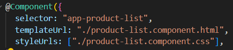
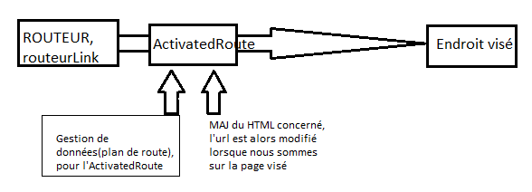
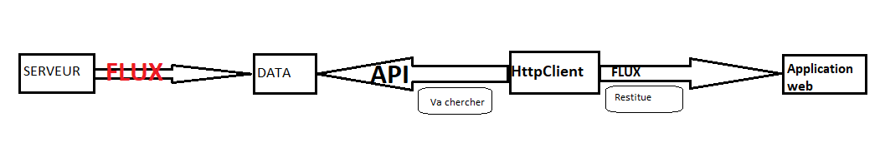

//DECOUVERTE DU FRAMEWORK ANGULAR// remarques, explications, étonnements  
  

 
# PARTIE 1 --- INITIATION ---  

 
Angular organise un projet; ce projet est alors composé de composants; en créant un projet avec Angular c'est se créer un projet organisé avec des outils disponibles grâce à Angular. Lors de cette création, des pages types et des composants sont créés; moi, je suis le chef d'orchestre qui rendra tout ces composants, qui ne sont pas rattachés et qui ne mènent à rien, à un ensemble qui fonctionnne en symbiose via des échanges divers et variés que je devrais créer en fonction de mes besoins. Tout est modulable. Je peux ajouter autant de composant que nécessaire.  

  

1 PROJET =   

    -1 DOSSIER (ici, assets) contenants 1 index.html(trame de fond, mère) + 1 main.ts (import gnrl) + 1 styles.css 
  
    ET

    - DES COMPOSANTS contenants chacun:  
        - 1 html(trame supplémentaire, enfant) +   
        - 1 ts (gestion class, recuperation en import/export)+  
        - 1 css  

    Ils sont des enveloppes qui contiennent des methodes internes déclencheuses d'évenements. On parle de logique de composant.  
     Les mots clés à mettre dans les composants sont dans le RTFM. 
     Un composant peut se trouver dans un autre composant, c'est alors son enfant, donc cet enfant à son propre dossier aussi mais dans l'arborescence est-ce qu'il apparait physiquement dans son composant mère?

    ET  

    - 1 RACINE ANGULAR qui pilote tous les imports et qui s'exporte pour que ce soit utilisé dans d'autres composants.

Dans chaque TS de chaque composant, il y a un @Component de type décorateur qui se crée automatiquement dès la création d'un nouveau composant? il fait le lien vers les fichiers? mais lesquels, ceux du composant où se trouve le decorateur? dans ce decorateur il y a toujours: - un selector: c'est une balise qui fait le lien vers qqch, - un lien template (templateUrl)  qui emmene vers le html du composant où se trouve le decorateur? - un style de composant (styleUrls) qui emmene vers le style du composant.

D'une manière gnrl, quelles sont les conséquences de la création d'un composant: generation des fichiers de base et création automatique de l'import dans le app.module, et ensuite il faut ajouter un routeur pour que ce soit lié? enfin, pour terminer, finalisé en modifiant mon html. Puis-je résumer à ça?

### J'Y COMPREND QUOI, J'Y COMPREND RIEN  

A ce stade, je comprends qu'Angular organise, et visuellement c'est très clair; en revanche, sur le fond, si je ne suis pas à l'origine des import/export, ou si ce n'est pas commenté, je ne fais pas le lien ni comprends les interactions crées, ou les conséquences de certains changements.

# PARTIE 2 --- ROUTING ---  

Le routing c'est reprendre qqch qui mène à rien afin qu'il mène qqpart. 
Le routeur permet d'afficher les composants concernés par l'URL choisit, cad si la route est créée on peut aller à l'endroit visé. 
Un RouteurModule est créé dans l'import du @NgModule dans le module racine: l'app.module. Celui-ci contient des path qui donnent un nom et le chemin qu'il doit prendre. Est-ce bien ça? 
Ce routeur est fixe mais on peut y ajouter des elements au fur et à mesure. Toujours avec un "path". On peut aussi y ajouter un id pour aller vers le lien précis recherché. Utilité?
Le routeur nécessite l'activation de la route via ActivatedRoute qui est specifique à chq composant; ce dernier contient des infos sur l'itinéraire et les paramètres de l'itinéraire; en injectant ça, on configure le composant pour utiliser les services, c'est la gestion des données dans cet ActivatedRoute qui gère ces services; les services sont les plans de route et la configuration.   
ActivetedRoute est un attribut dans une classe; les methodes qui sont ds cette classe permettent de faire le nécessaire pour faire le routing des endroits visés.  

Des canalisations sont nécessaires afin de transformer des données dans mon HTML ([routerLink]?).
Concretement, tout ça génère une nouvelle page url (l'url à proprement parlé est modifié), quand on clic sur qqch. 

### J'Y COMPREND QUOI, J'Y COMPREND RIEN  

Ce n'est pas clair pour moi. Mon schéma me permet de mieux comprendre, s'il est bon. J'ai besoin d'exemple simple et concret. 

# PARTIE 3 --- DATA ---  

Qu'est ce que je dois entendre par data? 
Dans le module "data", je remarque que pour la création de la "cart" on a demandé à Angular la generation d'un "service" puis d'un composant "cart". Je n'ai pas constaté ou retenu comment ça a produit ce que je vois dans l'arborescence; Je vois, qu'au même titre qu'un composant classique, un dossier cart "different"(car vert avec logo) apparait contenant les mêmes fichiers qu'un composant classique; je suppose que c'est la generation "service" qui donne le petit panier à ce "composant?". Mes questions sont: pour un composant de type "panier" est-ce grâce à cette manière de la génerer que l'on peut ensuite l'utiliser en tant que tel, cad pour stocker des produits, et pour pouvoir y adjoindre une éventuelle expédition?
A NOTER:  
D'autre part, des données sont stockées dans le json.  

Dans Angular, il y a un module intégré nommé HttpClient; c'est un moyen de récupérer des données;  

HttpClientModule enregistre les fournisseurs dont l'appli à besoin pour utiliser le HttpClient. Ces fournisseurs sont ajoutés qd je note dans mon @NgModule de la racine app.module "HttpClientModule".
Le Html doit ensuite être MAJ avec un canal "async". Ce dernier renvoie la dernière valeur d'un flux de donné et continue de le faire tant que le composant est en vie. J'ai été lire le manuel, mais c'est vraiment abstrait pour moi.  

### J'Y COMPREND QUOI, J'Y COMPREND RIEN  

Mes doutes et mes interrogations sont sur l'emplacement et la manière dont je dois gerer tout ces mouvements et ces appels d'élements.

# PARTIE 4  --- FORMULAIRE ---  

Un formulaire, c'est quoi? Le formulaire est un support informatique permettant de collecter des informations diverses et variées.
Le modèle de formulaire choisit permet de déterminer son statut. CAD? quel statut? paiement par exemple? 
On a alors importé FormBuilder qui est un service permettant de fournir des methodes pratiques pour génerer des contrôles. Comme a chaque import, dans une classe dédiée et l'enregistrement dans un constructeur, on confirme ce nouveau service. En revanche je n'ai pas compris comment on l'a implementé dans la classe (besoin d'explication sur la synthaxe). Il y a tellement de choses créées précedement, auquel on fait appel, que je suis perdue, probablement du fait que ce n'est pas moi qui ait réfléchit à ces liaisons et besoins. Preuve en est, je ne retrouve pas où se trouve la methode (group()?) qui vient définir la propriété (checkoutForm) qui contient les champs choisis.  
Une seconde methode est nécessaire afin de vider le panier et réinitialiser le formulaire (onSubmit()). Ce formulaire doit ensuite être relié au panier lors du paiement. Enfin, pour écouter la soumission du formulaire et appeler la methode onSubmit() avec le checkoutForm, j'ajoute une liaison (@ngSubmit).   

 ### ATTENTE: UN SCHEMA GNRL DES INTERACTIONS
